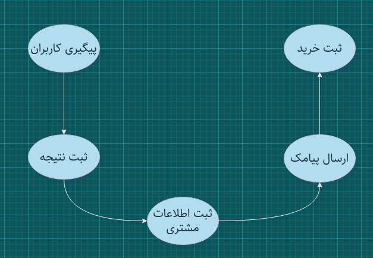
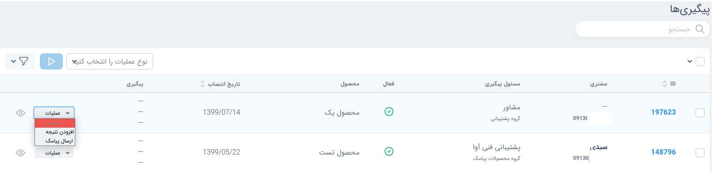
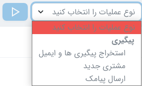
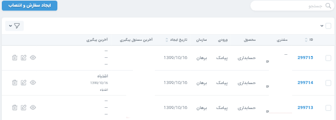
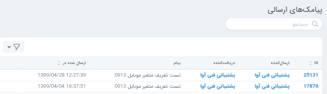

- [پیگیری ها](#پیگیری-ها)
- [مشتریان](#مشتریان)
- [پشتیبانی](#پشتیبانی-مشتریان)
- [پیامک های ارسالی](#پیامک-های-ارسالی)

---

#### پیگیری ها

پس از آنکه درخواست مشتریان به مسئول پیگیری مربوطه انتصاب داده شد، وضعیت سفارشات از طریق بخش پیگیری قابل رویت می باشد.

برای ثبت مشتری جدید به صورت دستی از باکس عملیات، مشتری جدید را انتخاب نمایید.

با نمایش هر پیگیری می تواند پیگیری های گذشته مشتری را مشاهده نمایید.

###### عملیات

برای هر پیگیری امکان انجام عملیات های زیر می باشد:

- ارسال پیامک

- افزودن نتیجه

- استخراج پیگیر ها و ایمیل ها

#### مشتریان

در این قسمت می توانید اطلاعات مربوط به مشتریان سامانه را مشاهده و ویرایش کنید. اطلاعات هر مشتری در آوا مطابق با تصویر زیر می باشد.

#### سفارشات و انتصاب

در بخش سفارشات و انتصاب، شماره های دریافت شده سامانه دیده می شوند. شماره های انتصاب شده مسئول پیگیری دارند و شماره های انتصاب نشده این فیلد را ندارند.
با نمایش سفارشاتی که انتصاب داده شده اند جزئیات پیگیری ها را نیز می توانید مشاهده نمایید.
امکان ویرایش سفارشات در این بخش وجود دارد.

#### پشتیبانی مشتریان

این قسمت برای ثبت پیگیری هایی که بعد از خرید در راستای پشتیبانی مشتریان انجام می شود قابل استفاده می باشد.

#### پیامک های ارسالی

در این بخش پیامک های ارسال شده برای مشتریان را می توانید مشاهده نمایید. گیرنده پیام ، تاریخ و ساعت ارسال در این بخش قابل مشاهده هستند.

