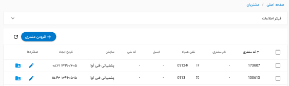
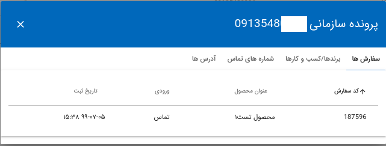

* [داشبورد](#داشبورد)
* [پیگیری ها](#پیگیری-ها)
* [مشتریان](#مشتریان)
* [سفارشات تکرار شده](#سفارشات-تکراری)
* [پشتیبانی](#پشتیبانی)
* [پیام ها](#پیام-ها)
* [وظایف](#وظایف)
* [گزارشات](#گزارشات)
* [تنظیمات](#تنظیمات)
* [حساب کاربری](#حساب-کاربری)
* [تغییر رمز عبور](#تغییر-رمز-عبور)

#### داشبورد 
در تصویر زیر نمونه ای از داشبورد مشاوران را می بینید.

#### پیگیری ها 

از از طریق تنظیمات جدول می توانید اطلاعاتی که برای شما نمایش داده خواهد شد را مشخص نمایید.

پس از آنکه درخواست مشتریان به مسئول پیگیری مربوطه انتساب داده شد، وضعیت سفارشات از طریق بخش پیگیری قابل رویت می باشد.

 پیگیری ها در این بخش شامل اطلاعات زیر می باشند.

رنگ هر پیگیری با توجه به نتیجه آن متفاوت می باشد. 
 
 
 ارسال پیامک:
 برای ارسال پیامک به مشتریان روی آیکون سه نقطه کلیک کرده و گزینه ارسال پیامک را انتخاب کنید.
 سپس عنوان پیامک موردنظر را انتخاب کنید و گزینه ارسال را بزنید.
 
 ثبت نتیجه پیگیری:
 برای ثبت پیگیری جدید گزینه نتیجه پیگیری را انتخاب کنید و در قسمت "ثبت نتیجه جدید" عنوان نتیجه را انتخاب کنبد. در صورت لزوم می توانید توضیحات اضافه و یا یک فایل به نتیجه پیگیری بیفزایید.
 
 مشاهده پیگیری ها:
 برای مشاهده پیگیری های قبلی گزینه ثبت نتیجه را انتخاب نمایید. در صفحه باز شده می توانید پیگیری های قبلی را مشاهده نمایید. 
 
 پیامک های ارسال شده:
 آیکون سه نقطه پیگیری و سپس گزینه پیامک های ارسال شده را انتخاب نمایید.
 
 ویرایش اطلاعات:
 همچنین امکان ویرایش پیگیری ها از طریق آیکون ویرایش وجود دارد. در قسمت ویرایش شماره موبایل مشتری قابل تغییر نمی باشد.
 
 
 عملکرد گروهی در این بخش شامل حذف گروهی پیگیری ها و ارسال گروهی پیامک می باشد.

#### مشتریان 

 در این قسمت می توانید اطلاعات مربوط به مشتریان سامانه را مشاهده و ویرایش کنید.
 
 
 
 
 همچنین میتوانید در این بخش پرونده سازمانی برای مشتریان تشکیل دهید.
 
 

#### سفارشات تکراری 

  در صورتی که سفارش یک محصول توسط شماره موبایل یکسان تکرار شود، سفارش تکرار شده محسوب می شود که در این بخش قابل مشاهده است.
  
 
 

#### پشتیبانی 

این قسمت برای پشتیبانی بعد از خرید مشتریان طراحی شده است. با کلیک روی ثبت پشتیبانی می توانید عنوان نتیجه پشتیبانی را انتخاب نمایید و در صورت لزوم توضیحات و یا فایلی را به پشتیبانی بیفزایید.

در قسمت جزئیات هر فروش می توانید تمامی اطلاعات مربوط به آن، اعم از تراکنش ها و آدرس مشتری را مشاهده نمایید.

#### پیام ها 
برای ارسال پیام به کاربران سامانه می توان از بخش پیام استفاده نمود. در این بخش امکان فیلتر کردن پیام ها به دو شکل نیز وجود دارد.
 
 پیام هایی که خوانده نشده اند به صورت یک اطلاعیه در سامانه نمایش داده می شوند.
 
 در محیط چت هر پیام می توانید پیام موردنظر را از طریق (بستن پیام)ببندید. برای دسترسی بهتر، می توانید پیام ها را فیلتر نمایید.
  
  
  
  **ارسال تیکت به پشتیبان:**
  
  برای برقراری ارتباط با پشتیبانی سامانه آوا می توانید از بخش پیام ها استفاده نموده و تیکت خود را ارسال نمایید.
  
 
#### وظایف 
 بخش وظایف در سامانه نوعی یادآور محسوب می شود.
 
 در این سامانه وظایف شامل عنوان،توضیحات،تاریخ و وضعیت می باشند.
 
  وظایف ثبت شده براساس وضعیتی که دارند در چهار ستون متفاوت قابل بررسی هستند.
  وضعیت وظایف با یک علامت مشخص می شوند. برای مثال وظیفه ای که در ستون "در حال انجام" است را می توانید با تیک زدن به "انجام شده" منتقل کنید.
 
 
 
 وظایف روز به صورت یک اطلاعیه در نوار بالایی سامانه قابل مشاهده می باشد. 
 
 
 
 درنظر داشته باشید که می توانید وظایف را از بخش پیگیری نیز ایجاد کنید. عنوان هر وظیفه در بخش پیگیری شماره موبایل مشتری می باشد.
 
 
 
#### گزارشات 
این بخش برای بررسی و تحلیل آمار فروش استفاده می شود.

گزارش فروش نهایی:
با انتخاب بازه زمانی موردنظر (حداکثر چهار ماه) تعداد شماره هایی که به شما انتساب شده اند، تعداد فروش ها و درصد تبدیل این دومقدار برای شما نمایش داده می شود.

گزارش کل:
 در این بخش می توانید با انتخاب فیلتر مناسب وضعیت شماره های انتساب داده شده و پیگیری های خود را در بازه موردنظر مشاهده کنید.

#### تنظیمات 

 **متغیر پیامک:**
 
در این بخش برای هر متغیر پیامک مقدار موردنظر خود را وارد نمایید و سپس ذخیره نمایید.

#### حساب کاربری 
در بخش حساب کاربری می توانید تنظیمات مربوط به حساب خود را تغییر دهید و یا رمز عبور خود را تغییر دهید.
 توجه داشته باشید اگر رمز عبور خود را فراموش کردید به دو صورت می توانید رمز خود را بازیابی کنید:
 
###### تغییر رمز عبور
 ۱. در صفحه ورود به سامانه (login) روی "پسورد خود را فراموش کرده اید؟" کلیک سپس ایمیل خود را وارد کنید، لینک تغییر پی.رد برای شما ارسال خواهد شد.
 
 ۲.مدیر سازمان نیز می توانید پسورد کاربری اعضا را تغییر دهد.
 
#### 