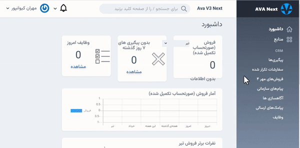

- [محصولات](#محصولات)
- [مشاوران](#مشاوران)
- [انتصاب](#انتصاب)
- [ پیگیری ها](#پیگیری-ها)
- [ سفارشات تکراری](#سفارشات-تکراری)
- [ پشتیبانی مشتریان](#پشتیبانی-مشتریان)
- [پیامک های ارسالی](#پیامک-های-ارسالی)
- [پیام های سازمانی](#پیام-های-سازمانی)

---

###### محصولات

برای مطالعه جزئیات به [محصولات](../organizer/#محصولات) بخش صاحب سازمان مراجعه نمایید.

###### مشاوران

برای مطالعه جزئیات به [مشاوران](../organizer/#مشاوران) بخش صاحب سازمان مراجعه نمایید.

#### انتصاب

در بخش انتصاب، سرپرست هر گروه می تواند شماره های دریافت شده را به اعضای گروه خود انتصاب دهد.

درباره انتصاب می توانید بیتشر بخوانید. [انتصاب](../organizer/#انتصاب)

#### پیگیری ها

سرپرست گروه ها می توانند پیگیری مشاوران گروه خود را در بخش پیگیری ها مشاهده نمایند.
درباره پیگیری بیشتر بخوانید.[پیگیری](../organizer/#پیگیری-ها)

#### سفارشات تکراری

در صورتی که سفارش یک محصول توسط شماره موبایل یکسان تکرار شود، سفارش تکرار شده محسوب می شود که در این بخش قابل مشاهده است.

#### پشتیبانی مشتریان

این قسمت برای ثبت پیگیری هایی که بعد از خرید در راستای پشتیبانی مشتریان انجام می شود قابل استفاده می باشد.

در قسمت پشتیبانی مشتریان می توانید از فیلتر مشاور و محصول استفاده نمایید.

وضعیت صورتحساب:

وضعیت صورتحساب مشتریانی که در سامانه مهر محصول ثبت کرده اند در بخش پشتیبانی مشتریان قابل مشاهده است. همچنین سایتی که صورتحساب کاربر در آن ثبت شده است نیز نمایش داده می شود.

#### پیامک های ارسالی

در این بخش پیامک های ارسال شده برای مشتریان را می توانید مشاهده نمایید. گیرنده پیام ، تاریخ و ساعت ارسال در این بخش قابل مشاهده هستند.

#### پیام های سازمانی

در این بخش اعضای سازمان می توانند برای یکدیگر پیام فرستاده و در صورت لزوم به آنها پاسخ دهند.

> <i class='fas fa-ban' style='font-size:20px;color:gray;margin-left:15px'></i>
> فقط می توانید تا 10 مگابایت فایل بفرستید

