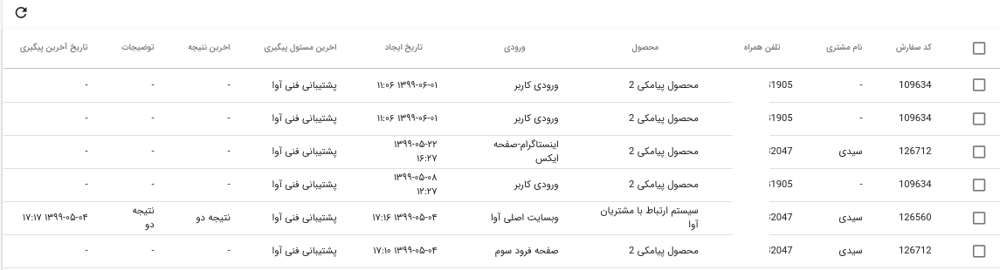
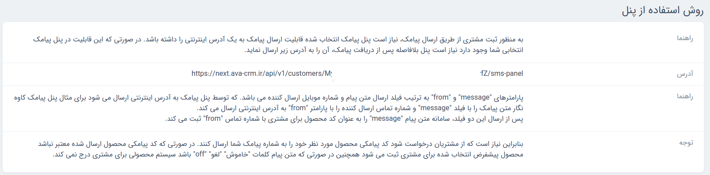

* [تعاریف](#تعارف)
* [داشبورد](#داشبورد)
* [پیگیری](#پیگیری)
* [مشتریان](#مشتریان)
* [سفارشات و انتساب](#سفارشات-و-انتساب)
* [سفارشات تکرار شده](#سفارشات-تکرار-شده)
* [پشتیبانی مشتریان](#پشتیبانی-مشتریان)
* [پیام ها](#پیام-ها)
* [انتساب سیستمی](#انتساب-سیستمی)
* [وظایف](#وظایف)
* [گزارشات](#گزارشات)
* [تنظیمات](#تنظیمات)
* [وب سرویس](#وب-سرویس)
* [حساب کاربری](#حساب-کاربری)
* [تغییر رمز عبور](#تغییر-رمز-عبور)

#### تعاریف

برای استفاده از این سامانه لازم است داده های بخش تعاریف توسط مدیریت واحد تجاری وارد شوند. در ادامه با هر بخش به صورت کامل آشنا می شوید.

##### دسته بندی
در این بخش لازم است برای محصولات مرتبط به هم ، دسته بندی ایجاد کنید. 

><i class='fas fa-exclamation-triangle' style='font-size:20px;color:gray;margin-left:15px'></i>
>توجه کنید پیش از افزودن محصول دسته بندی مربوط به آن را ایجاد کرده باشید. برای ایجاد محصول انتخاب دسته بندی الزامی است. 

##### محصولات
محصولات واحد های تجاری در این بخش وارد می شوند. برای افزودن محصول، نام محصول را وارد کرده و دسته بندی مربوط به محصول را انتخاب نمایید.
برای جستجوی محصولات می توانید از فیلتر اطلاعات استفاده نمایید.

**ویرایش:**
در قسمت ویرایش می توانید کد های پیامکی  مربوط به هر محصول را مشاهده و کد پیامکی جدید اضافه نمایید.

در ادامه درباره [کد پیامکی محصولات](#کد-پیامکی-محصولات) توضیح داده شده است.

عملکرد گروهی در این بخش شامل "حذف گروهی محصولات" می باشد.

##### نتایج پیگیری
 در این بخش برای وضعیت پیگیری هایی که انجام می شوند نتایجی را از پیش تعریف می کنند. همچنین می توان برای هر نتیجه پیگیری یک رنگ انتخاب نمود. برای مثال می توان برای تماس هایی که توسط مشتری پاسخ داده نمی شوند نتیجه "بی پاسخ" را تعریف نمود. این نتایج برای ثبت پیگیری ها استفاده می شوند.

 
 
##### نتایج پشتیبانی
برای ثبت وضعیت پشتیبانی هایی که بعد از خرید محصول انجام می شوند نیز نتایجی را از پیش تعریف می کنند. 

##### گروه ها-انتساب 
در سامانه آوا می توان اعضای فروش و بازاریابی را در قالب گروه هایی مشخص تعریف کرد. 

**افزودن گروه:** دکمه افزودن گروه در سمت چپ، برای ایجاد گروه های  جدید استفاده می شود. برای ایجاد گروه نام گروه را وارد نمایید و سرپرست گروه را از بین کاربران انتخاب کنید.

**دسته بندی های گروه:** برای افزودن دسته بندی محصولات به گروه فروش مربوطه از بخش "دسته بندی های گروه" اقدام کنید.
در این قسمت نام دسته بندی موردنظر را انتخاب کنید. سپس درصد دسته بندی را اضافه نمایید. 

درصد دسته بندی میزان انتساب سفارشات ثبت شده مربوط به این دسته بندی به گروه موردنظر را مشخص می کند.
برای مثال در نظر بگیرید درصد دسته بندی۱ برای گروه a برابر با ۵۰ باشد.اگر 200 سفارش برای دسته بندی ۱ ثبت شود ، 100 عدد از سفارشات ثبت شده به گروه a انتساب می شوند.

**اعضا:** برای مشاهده اعضای گروه و افزودن کاربر به گروه روی اعضا کلیک کنید. 

**افزودن کاربر:** برای افزودن کاربر **نام کاربر** را جستجو و انتخاب کنید. **درصد انتساب** میزان سفارشاتی که به این کاربر انتساب داده می شوند را از کل سفارشات گروه مشخص می کند. **حداکثر تعداد** سفارشاتی که به کاربر انتساب داده می شوند نیز ثبت کنید. **وضعیت کاربر** فعال یا غیر فعال بودن کاربر را نشان می دهد.

##### ورودی ها
منبع ثبت سفارشات در سامانه توسط ورودی ها مشخص می شوند. 

#####   کاربران
اعضای واحد تجاری که در آوا فعالیت می کنند کاربران سامانه محسوب می شوند. کاربران سامانه را می توان با سه نقش متفاوت مشاور،سرپرست و سازمان می توان ثبت نمود. برای افزودن کاربر فیلد های مشخص شده در تصویر باید تکمیل گردند.

#####   پیامک
در این سامانه پیامک های قابل ارسال برای مشتریان پیامک از پیش تعریف شده هستند. برای ایجاد پیام یک عنوان و یک متن وارد نمایید. 

**متغیر پیامک:** در متن پیامک ها می توانید مقادیر قابل تغییری ایجاد نمایید که هر ارسال کننده پیام آن را از بخش تنظیمات به دلخواه مشخص نماید. متغیر پیامک در متن پیام باید بین دو (%) قرار گیرد.

تصویر زیر نمونه ای از پیامک ها را نشان می دهد.

##### کد پیامکی محصولات 
برای محصولات سامانه که به صورت پیامکی سفارش داده می شوند یک کد پیامکی انتخاب می کنند. هر محصول برای ورودی های مختلف کد پیامکی متفاوت خواهد داشت.
برای هر کد پیامکی شماره پنل پیامک را هم اضافه نمایید.

 

******

#### داشبورد
داشبورد سامانه آوا برای نقش سازمان مطابق تصویر زیر می باشد.

******

#### پیگیری

پس از آنکه درخواست مشتریان به مسئول پیگیری مربوطه انتساب داده شد، وضعیت سفارشات از طریق بخش پیگیری قابل رویت می باشد.

از طریق تنظیمات جدول می توانید اطلاعاتی که برای شما نمایش داده می شود را مشخص نمایید.

 در حساب کاربری سازمان ها، بخش پیگیری شامل اطلاعات زیر می باشند. همانگونه که ملاحضه نمودید در بخش پیگیری کاربرانی که نقش سازمان را دارند می توانند نام مسئول پیگیری، گروه فروش و ورودی سفارش را نیز مشاهده نمود.

 در بخش [پیگیری مشاوران](../advicer/#پیگیری) می توانید با کارکرد این بخش آشنا شوید.
 

 *******
 
 #### مشتریان 
 
 در این قسمت می توانید اطلاعات مربوط به مشتریان سامانه را مشاهده و ویرایش کنید. اطلاعات هر مشتری در آوا مطابق با تصویر زیر می باشد. 
 
 
  
 
 همچنین میتوانید در این بخش پرونده سازمانی برای مشتریان تشکیل دهید.
 
  
 
 *******
 
 #### سفارشات و انتساب 
 
در بخش سفارشات و انتساب شماره های دریافت شده سامانه دیده می شوند. شماره های انتساب شده مسئول پیگیری دارند و شماره های انتساب نشده این فیلد را ندارند. در این بخش می توان محصول سفارش داده شده و ورودی را از قسمت ویرایش تغییر داد و به سفارشات ثبت شده مسئول پیگیری افزود.

در این بخش امکان افزودن تکی و گروهی سفارشات به صورت دستی وجود دارد. 

 *******
 
 #### سفارشات تکرارشده
 
  در صورتی که سفارش یک محصول توسط شماره موبایل یکسان تکرار شود، سفارش تکرار شده محسوب می شود که در این بخش قابل مشاهده است.
  
 
 
 درصورتی که تمایل دارید سفارشات تکراری برای یک مشتری ثبت نشود به قسمت تنظیمات رفته و در بخش پیگیری ها تیک گزینه اول را بزنید و ذخیره نمایید.
 در صورتی که این تیک را نزنید امکان انتساب یک مشتری به دو مسئول پپیگیری وجود دارد.
 [تنظیمات](#تنظیمات) 
 *******
 
 #### پشتیبانی مشتریان 
 این قسمت را در [پشتیبانی](../advicer/#پشتیبانی) بخوانید.
*****

#### پیام ها 
 این قسمت را در [پشتیبانی](../advicer/#پیام-ها) بخوانید.
 *******
 
#### انتساب سیستمی 
 
  برای انتساب سفارشات (شماره ها) به گروه ها از طریق انتساب سیستمی اقدام نمایید. در این بخش می توانید گروه هایی که تعریف کرده اید رامشاهده و با یک کلیک روی هر گروه، اعضای گروه را بررسی نمایید.
 
 
><i class='fas fa-info' style='font-size:20px;color:gray;margin-left:15px'></i>
> در صورتی که یک دسته بندی به چند گروه انتساب شده است (درصد دسته بندی) هنگام انتساب سفارشات همه گروه های مذکور را باهم انتخاب و انتساب دهید.

انتساب در این قسمت به دو روش است: ۱.انتساب کل گروه ها ۲.انتساب گروه های انتخابی 

۱. برای انتساب کل گروه ها دکمه آبی بالای صفحه را انتخاب کنید.

۲. برای انتساب چند گروه، حداکثر تا پنج گروه را انتخاب کنید و سپس انتساب دهید.

 
 
 ***
 
#### وظایف 
 این قسمت را در [پشتیبانی](../advicer/#وظایف) بخوانید.
 ***
 
#### بازاریابی و فروش 
 
 بخش بازاریابی و فروش سامانه آوا شامل پنل پیامکی می باشد:
 
###### پنل پیامکی 
 در این بخش امکان تنطیم و یا افزدون پنل های پیامکی وجود دارد. برای افزودن پنل پیامکی لازم است فیلد های صفحه باز شده را تکمیل نمایید.
 
 **افزودن پنل پیامکی:** برای افزودن پنل جدید روی دکمه آبی سمت چپ کلیک کنید و فیلدهای صفحه باز شده را وارد نمایید.
  
 برای هر شماره پیامک یک ورودی و یک محصول پیش فرض تعریف می شود تا در صورت اشتباه فرستادن کد از سمت مشتری این دو مقدار به صورت پیش فرض ثبت شوند. فیلد "متن پیام" و فیلد "شماره ارسال کننده" برای هر پنل پیامکی متفاوت می باشد. برای مثل این دو مقدار در پنل کاوه نگار به ترتیب message و from می باشند.
 
 
 
 
 *****
 
#### گزارشات 
 این قسمت امکان تحلیل میزان فروش را برای همه کاربران آوا فراهم آورده است.
 
 **فروش نهایی:**
 
 در این نوع گزارشات می توان تعداد شماره های دریافتی هر مشاور،تعداد فروش و درصد تبدیل را برای هر فرد در یک بازه زمانی مشخص مشاهده نمود.
 
   
 ><i class='fas fa-info' style='font-size:20px;color:gray;margin-left:15px'></i>
 >درنظر داشته باشید که سرعت بارگذاری اطلاعات به فیلترهای انتخاب شده بستگی دارد و بازه زمانی مورد بررسی نباید بیش از ۴ ماه نباشد. 

  
  
  **گزارشات کل:**
  
  در بخش گزارشات کل امکان مشاهده پیگیری های همه کاربران وجود دارد.

 ساخت گزارش:
 
برای استفاده بهتر از این بخش پیشنهاد می شود اطلاعات موردنیاز خود را از بخش فیلتر (ساخت گزارش) انتخاب نمایید. برای مثال می توانید همه پیگیری های بدون نتیجه را در یک بازه مشخص انتخاب و نمایش دهید. 
 
 
 
 *****
 
#### تنظیمات 
 **پیامک:**
 برای تنظیم پنل پیامک از این بخش اقدام نمایید.نحوه تنظیم پنل پیامکی کاوه نگار را از طریق لینک زیر مشاهده نمایید.
 
 http://demo.ava-crm.ir/help
 
 
 **پیگیری ها:**
 این قسمت مربوط به سفارشات تکراری و پیگیری های مجدد یک مشتری می باشد. 
 
 
**متغیرهای پیامک:** 
در این بخش برای متغیرهایی که در بخش [پیامک](#پیامک) تعریف شده اند یک مقدار ایجاد می کنید.

 درباره [متغیرهای پیامک](../advicer/#تنظیمات) بیشتر بخوانید.
 
 *****
 
#### وب سرویس 

 برای استفاده از بخش وب سرویس از طریق api مراحل زیر را دنبال کنید:
 
۱) به بخش وب سرویس رفته و لینک api را کپی نمایید.
 
۲) پیش از الصاق آن باید به جای {company-token} توکن سازمان خود را جایگزین کنید.
  
۳) برای کپی کردن توکن سازمان این مسیر را دنبال کنید: تعارف/سازمان/ویرایش سازمان/توکن/کپی توکن 
 
   
۴) توکن خود را به جای company token، الصاق نمایید.
  

  
 ****
 
#### حساب کاربری 
 در بخش حساب کاربری می توانید تنظیمات مروبط به حساب خود را تغییر دهید و یا رمز عبور خود را تغییر دهید.
 توجه داشته باشید اگر رمز عبور خود را فراموش کردید به دو صورت می توانید رمز خود را بازیابی کنید:
 
 
##### تغییر رمز عبور
 ۱. در صفحه ورود به سامانه (login) روی "پسورد خود را فراموش کرده اید؟" کلیک سپس ایمیل خود را وارد کنید، لینک تغییر پسورد برای شما ارسال خواهد شد.
 
 ۲.مدیر سازمان نیز می توانید پسورد کاربری اعضا را تغییر دهد.
 
 تغییر پسورد کاربران:
 برای تغییر پسورد اعضای سازمان خود از مسیر زیر استفاده نمایید:
 
  تعاریف /کاربران / جستجوی کاربر/ تغییر کلمه عبور
  
  
  
  