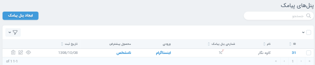

- [سازمان](#سازمان)
- [گروه ها](#گروه-ها)
- [پیگیری ها](#پیگیری-ها)
- [مشتری](#مشتری)
- [سفارشات و انتصاب](#سفارشات-و-انتصاب)
- [سفارشات تکراری](#سفارشات-تکراری)
- [پشتیبانی مشتریان](#پشتیبانی-مشتریان)
- [مشاوران](#مشاوران)
- [پیامک های ارسالی](#پیامک-های-ارسالی)
- [پیامک های دریافتی](#پیامک-های-دریافتی)
- [انتصاب](#انتصاب)
- [اتصال به آسیا اس ام اس](#اتصال-به-آسیا-اس-ام-اس)

---

#### سازمان

در این بخش می توانید جزئیات سازمان خود را مشاهده و آن را ویرایش نمایید.

###### وب سرویس

در این بخش می توانید روش استفاده از وب سرویس را مشاهده نمایید.

###### ثبت فروش مهر

مطابق تصویر برای ثبت فروش سامانه مهر ۴ از طریق ای پی آی آدرسی که در این بخش قرار دارد را در تنظمات مربوطه در سامانه مهر قرار دهید.

###### پنل های پیامکی

در این بخش امکان تنطیم و یا افزدون پنل های پیامکی وجود دارد. برای افزودن پنل پیامکی لازم است فیلد های صفحه باز شده را تکمیل نمایید.

افزودن پنل پیامکی: برای افزودن پنل جدید روی دکمه آبی سمت چپ کلیک کنید و فیلدهای صفحه باز شده را وارد نمایید.

برای هر شماره پیامک یک ورودی و یک محصول پیش فرض تعریف می شود تا در صورت اشتباه فرستادن کد از سمت مشتری این دو مقدار به صورت پیش فرض ثبت شوند. فیلد “متن پیام” و فیلد “شماره ارسال کننده” برای هر پنل پیامکی متفاوت می باشد. برای مثل این دو مقدار در پنل کاوه نگار به ترتیب message و from می باشند.

در صورتی که می خواهید اطلاعاتی که از یک پنل پیامک دریافت می شود به مسیر دیگری بازارسال شود لازم است ، آدرس موردنظرتان را در فیلد بازارسال اطلاعات(وب هوک) قرار دهید.
برای باز ارسال مشتریانی که به صورت فایل اکسل به سامانه وارد می شوند نیز لازم است این فیلد را پر نمایید.

[ استخراج مشتری از فایل پیامک](#استخراج-مشتری-از-فایل-پیامک)

> <i class='fas fa-info' style='font-size:20px;color:gray;margin-left:15px'></i>
> با کلیک روی هر پنل پیامکی می توانید روش استفاده از پنل را مشاهده نمایید.
> 

###### قالب پیامک

.در این سامانه پیامک های قابل ارسال برای مشتریان پیامک از پیش تعریف شده هستند. برای ایجاد پیام یک عنوان و یک متن وارد نمایید
در نگارش متن پیام به راهنمای قالب پیامک در همان صفحه توجه نمایید. در صورتی که در سازمان شما متغیری به غیر از موارد تعریف شده نیاز است به بخش فنی درخواست افزودن متغیر جدید را اعلام نمایید.

###### دسته بندی ها

در این بخش لازم است پیش از وارد نمودن محصولات واحد تجاری خود، دسته بندی محصولات را تعریف کنید.
برای ایجاد دسته بندی تنها یک نام برای آن تعریف کنید.
در بخش دسته بندی ها می توانید مشاهده کنید که هر دسته بندی در کدام گروه ها استفاد می شود.

###### نتایج پیگیری

برای ثبت پیگیری هایی که توسط اعضای سازمان انجام می شوند، می توان نتایجی را از پیش تعریف نمود.

###### محصولات

محصولات واحد های تجاری در این بخش وارد می شوند. برای افزودن محصول نام آن را وارد کرده،یک کد پیامکی برای آن تعریف نمایید و دسته بندی محصول را انتخاب نمایید.

در ادامه درباره [کد پیامکی محصولات](#کد-پیامکی-محصولات) توضیح داده شده است.

###### ورودی ها

منبع ثبت سفارشات در سامانه توسط ورودی ها مشخص می شوند.

###### نتایج پشتیبانی

برای ثبت وضعیت پشتیبانی هایی که بعد از خرید محصول انجام می شوند نیز نتایجی را از پیش تعریف می کنند.

###### اعضا

اعضای سازمان خود را می توانید در این بخش مشاهده نمایید. اعضای سامانه آوا در سه نقش صاحب سازمان،سرپرست و مشاور تعریف می شوند.

برای تغییر پسورد اعضای سازمان، از گزینه ویرایش می توانید استفاده نمایید.

برای ورود به سامانه با هویت اعضای سازمان خود می توانید از گزینه (impersonate) استفاده نمایید.

#### گروه ها

اعضای سازمان ها برای فعالیت در سامانه آوا باید در گروه ها عضو باشند.

###### ایجاد گروه

به بخش تعاریف بروید و یک گروه جدید ایجاد کنید. لازم است برای هر گروه یک سرپرست انتخاب شود.

###### اعضای گروه

پس از ایجاد گروه اعضای موردنظرتان را به گروه اضافه نمایید.

هنگام ایجاد اعضای گروه ،برای هر عضو یک درصد انتصاب نیز باید مشخص نمود.

درصد انتساب میزان سفارشاتی که به این کاربر انتساب داده می شوند را از کل سفارشات گروه مشخص می کند. حداکثر تعداد سفارشاتی که به کاربر انتساب داده می شوند نیز ثبت کنید.

وضعیت کاربر فعال یا غیر فعال بودن کاربر را نشان می دهد.

###### دسته بندی گروه

پس از ایجاد گروه، دسته بندی محصولات موردنظرتان را هم به گروه اضافه نمایید.

لازم است برای هر دسته بندی در یک گروه درصد دسته بندی نیز تعریف نمایید.
درصد دسته بندی میزان انتصاب سفارشات ثبت شده مربوط به این دسته بندی به گروه موردنظر را مشخص می کند. برای مثال در نظر بگیرید درصد دسته بندی۱ برای گروه a برابر با 50 باشد.اگر 200 سفارش برای دسته بندی ۱ ثبت شود ، 100 عدد از سفارشات ثبت شده به گروه a انتساب می شوند.

#### پیگیری ها

پس از آنکه درخواست مشتریان به مسئول پیگیری مربوطه انتصاب داده شد، وضعیت سفارشات از طریق بخش پیگیری قابل رویت می باشد.

برای ثبت مشتری جدید به صورت دستی از باکس عملیات، مشتری جدید را انتخاب نمایید.

با نمایش هر پیگیری می تواند پیگیری های گذشته مشتری را مشاهده نمایید.

###### عملیات

برای هر پیگیری امکان انجام عملیات های زیر می باشد:

- ارسال پیامک

- افزودن نتیجه

- استخراج پیگیر ها و ایمیل ها

#### مشتری

در این قسمت می توانید اطلاعات مربوط به مشتریان سامانه را مشاهده و ویرایش کنید. افزودن مشتری به سامانه از طریق فایل و به صورت دستی هم امکان پذیر است.

###### استخراج مشتری با ورود موبایل

شماره های مشتریان را به گونه ای در فیلد وارد نمایید که در هر سطر یک شماره وجود داشته باشد. برای جدا کردن شماره ها از یکدیگر از کلید enter استفاده نمایید.

###### استخراج مشتری از فایل پیامک

برای افزودن مشتریان به سامانه از طریق فایل excel یا csv به بخش مشتریان بروید و عملیات استخراج مشتری از فایل پیامک را انتخاب نمایید.

برای افزودن فایل علاوه بر نکات ذکر شده در سامانه به چند مورد توجه نمایید:

- فایلی که بارگذاری می کنید باید ساختاری شبیه به فایل نمونه داشته باشد. یعنی ستون اول متن پیام(کد محصول ورودی)، ستون دوم شماره پنل پیامک، ستون سوم شماره ارسال کننده(مشتری)، ستون چهارم تاریخ دریافت پیام می باشد.

- تکمیل بودن سه ستون اول الزامی است. خالی بودن ستون چهارم(تاریخ) مانعی ندارد.
- کد محصول و شماره های پنل پیامک که در فایل وجود دارند حتما باید در سامانه تعریف شده باشند، در غیر اینصورت شماره های موجود در فایل ثبت نخواهند شد.
- گزینه باز ارسال در صورتی فعال خواهد شد که در تعریف پنل پیامک ها، فیلد باز ارسال اطلاعات (وب هوک)، با آدرس موردنظر شما پر شده باشد.[پنل های پیامکی](#پنل-های-پیامکی)

#### سفارشات و انتصاب

در بخش سفارشات و انتساب، شماره های دریافت شده سامانه دیده می شوند. شماره های انتساب شده مسئول پیگیری دارند و شماره های انتساب نشده این فیلد را ندارند. در این بخش می توان محصول سفارش داده شده و ورودی را از قسمت ویرایش تغییر داد.
با نمایش سفارشاتی که انتصاب داده شده اند جزئیات پیگیری ها را نیز می توانید مشاهده نمایید.

#### سفارشات تکراری

در صورتی که سفارش یک محصول توسط شماره موبایل یکسان تکرار شود، سفارش تکرار شده محسوب می شود که در این بخش قابل مشاهده است.

#### پشتیبانی مشتریان

این قسمت برای ثبت پیگیری هایی که بعد از خرید در راستای پشتیبانی مشتریان انجام می شود قابل استفاده می باشد.

در قسمت پشتیبانی مشتریان می توانید از فیلتر مشاور و محصول استفاده نمایید.

وضعیت صورتحساب:

وضعیت صورتحساب مشتریانی که در سامانه مهر محصول ثبت کرده اند در بخش پشتیبانی مشتریان قابل مشاهده است. همچنین سایتی که صورتحساب کاربر در آن ثبت شده است نیز نمایش داده می شود.

#### مشاوران

اعضای سازمان خود را می توانید در بخش مشاوران مشاهده نمایید.
همچنین امکان تغییر پسورد،ویرایش مشخصات اعضا و یا حذف اعضا وجود دارد.
برای تهیه گزارش پیگیری مشاوران از قسمت لنز می توانید استفاده نمایید.

#### پیامک های ارسالی

در این بخش پیامک های ارسال شده برای مشتریان را می توانید مشاهده نمایید. نام ارسال کننده،گیرنده پیام و تاریخ و ساعت ارسال در این بخش قابل مشاهده هستند.

#### پیامک های دریافتی

این بخش امکان مشاهده پیامک های دریافت شده از سوی متقاضیان را برای شما فراهم می کند. برای سهولت کاربران، فیلتر پیامک ها بر اساس تاریخ نیز امکان پذیر می باشد. همچنین می توانید پیامک های دریافتی هر پنل را به طور مجزا مشاهده نمایید.

#### کد پیامکی محصولات

برای تعریف کد پیامکی محصولات، مطابق تصویر لازم است شماره پنل پیامکی و ورودی محصول نیز مشخص شود.

#### انتصاب

در بخش انتصاب می توانید گروه ها و اعضای هر گروه را مشاهده نمایید. همچنین می توانید درصد انتصاب اعضا را پیش از انتصاب دادن شماره ها تغییر دهید.

#### اتصال به آسیا اس ام اس

**پیشنیاز:**

وارد سازمان خود در سامانه آوا شوید و دسته بندی،محصولات، کد پیامکی و ورودی را در سازمان خود تعریف نمایید.

1.روی نام سازمان خود کلیک نمایید و به پایین صفحه اسکرول کنید. در قسمت پنل های پیامک روی دکمه ایجاد پنل پیامک کلیک و مطابق تصویر اطلاعات لازم را وارد نمایید.

2.پس از ایجاد پنل دوباره روی نام سازمان خود کلیک نمایید. پنل پیامکی که در مرحله قبل ایجاد کردید را یافته آن را نمایش دهید.(روی آیکون چشم کلیک کنید.)

3.در صفحه باز شده به پایین صفحه اسکرول کنید. در انتهای صفحه روش استفاده از پنل را مطالعه و آدرس درج شده در این جدول را کپی نمایید.

4.وارد پنل خود در سایت آسیا اس ام اس شوید. وارد بخش تنظیمات و سپس انتقال ترافیک از نوار کنار شوید.

5.روی دکمه جدید کلیک نمایید.

6.در صفحه باز شده اطلاعات بالای صفحه مطالعه فرمایید و فیلد های لازم را تکمیل نمایید.(فیلد url را در مرحله بعد بخوانید.)
7.آدرس کپی شده را در فیلد url الصاق نمایید و سپس در ادامه آن متن زیر را قرار دهید.

**( to=$TO&message=$TEXT&from=$FROM? )**

**برای نمونه تصویر زیر یک url صحیح می باشد.**

