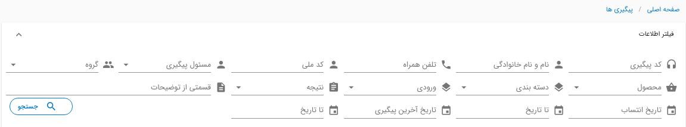
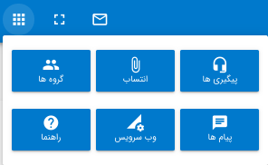
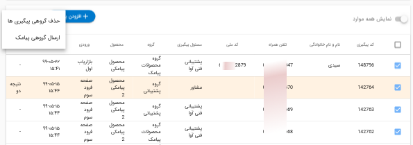

* [امکانات سامانه](#امکانات-سامانه)
* [مفاهیم سامانه](#مفاهیم-سامانه)
* [رابط کاربری پنل](#رابط-کاربری-پنل)

#### امکانات سامانه 
سامانه بازاریابی و فروش تلفنی آوا سیستمی نوین برای مدیریت مشتریان در کسب و کارها است. مزیت این سامانه نسبت به دیگر سامانه های مدیریت ارتباط با مشتری این است که این سامانه رابط کاربری راحتی دارد و امکانات ویژه ای برای همه کاربران فراهم کره است. دپارتمان فنی نوا به دلیل حساسیت امر فروش درتجارت سعی نموده است سیستمی با کمترین خطا و حداکثر سرعت در اختیار کسب و کارها قرار دهد. سامانه آوا به گونه ای طراحی شده است که پاسخگوی نیاز های همه واحد های تجاری بزرگ و کوچک باشد و در انواع فروش حضوری یا غیر حضوری قابل استفاده باشد. همچنین این سیستم امکان تحلیل عملکرد کارکنان و میزان فروش شرکت ها را در اختیار کارفرمایان قرار می دهد.
در ادامه به برخی ویژگی ها و امکانات این سامانه اشاره خواهیم کرد:

* دریافت شماره مشتریان از منابع مختلف تبلیغاتی
* پیگیری شماره ها به منظور بررسی نیاز مشتری و فروش محصولات
* پشتیبانی مشتریان نهایی و دریافت نظرات مشتریان
* مشاهده و ساخت گزارشات جامع
* انعطاف پذیر در تعاریف بخش های مختلف
* وب سرویس قدرتمند به منظور برقراری ارتباط با نرم افزارهای مختلف
* امکان سفارشی سازی بخش های مختلف
* ارسال پیامک به مشتریان
* اپلیکیشن اندروید
* امکان ارسال پیام به دیگر کاربران و ایجاد وظیفه(reminder) در سامانه
*****
#### مفاهیم سامانه 

###### پیگیری ها
پس از آنکه مشتری ها به مسئول پیگری مربوطه انتساب داده می شوند در بخش پیگری ها قابل مشاهده هستند. این بخش داری جزئیاتی می باشد که توضیح داده خواهند شد.

###### مسئول پیگیری 
 پس از ثبت درخواست توسط مشتری، سفارشات به مسئول پیگیری انتساب داده می شوند. مسئول پیگیری با مشتریان در تماس خواهد بود و بازاریابی، مشاوره و پشیبانی سفارشات را بر عهده دارد.

###### نتیجه پیگیری 
پس از آنکه سفارشات به مسئول پیگری انتساب داده شدند مسئول پیگیری با مشتری در ارتباط خواهد بود و نتیجه هربار پیگیری را ثبت می نماید. در این سامانه می توان هر نتیجه پیگیری را با یک رنگ اختصاصی نمایش داد.

###### کاربران 
در سامانه آوا۳ کاربران سایت با نقش های سازمان،سرپرست و مشاور ثبت می شوند و در بستر(crm) خدمات موردنیاز مشتریان را  ارائه می دهند.

###### انتساب 
سفارشات ثبت شده توسط مشتریان برای پیگیری و پشتیبانی باید به مسئول پیگیری مربوطه تحویل داده شوند که در این سامانه با عمل انتساب انجام می شوند.

###### وظایف 
در آوا می توان از بخش وظایف به عنوان یک یادآور روزانه استفاده نمود.

###### متغیر های پیامک 
در متن پیامک ها می توان یک مقدار قابل تغییر ایجاد نمود که هر کاربر سامانه به صورت دلخواه بتواند آن را تغریف کند. برای مثال نام مسئول پیگیری می تواند یک متغیر پیامک باشد.

###### کد ورودی 
کد ورودی منبع ثبت سفارش یک محصول را نشان می دهد. 

###### گزارشات 
از این بخش برای تحلیل میزان فروش کل واحد تجاری و هر یک از اعضای گروه بازاریابی می توان استفاده نمود. همچنین می توان میزان فروش را با تغییر محصول، زمان و منبع بازاریابی یررسی نمود.

*******

#### رابط کاربری پنل 

###### فیلتر اطلاعات 
منابع مختلف این سامانه را می توان با فاکتور های مختلف فیلتر و نمایش داد. نمونه ای از فیلتر اطلاعات در بخش  پیگیری را در تصویر زیر می بینید.

###### دسترسی سریع  
در نسخه وب سامانه آوا برای دسترسی راحت و سریع در نوار بالایی می توانید به بخش های پیگیری، انتساب، گروه ها،پیام ها،وب سرویس و راهنما دسترسی نمود.

###### تنظیمات جدول 
در بخش پیگیری ها می توانید اطلاعاتی که نیاز دارید نمایش داده شوند را از تنظیمات جدول انتخاب نمایید. مثلا اگر تیک کد ملی را انتخاب نکنید و نتیجه را انتخاب نمایید فقط ستون نتیجه برای شما نمایش داده می شود.

###### عملکرد گروهی 
در مواردی که نیاز است یک عملیات به صورت گروهی برای چند منبع انجام شود از عملکرد های گروهی می توان استفاده نمود. 

برای مثال برای ارسال پیامک مشترک به چند مشتری، ابتدا پیگیری های موردنظر را تیک بزنید و از قسمت عملکرد گروهی گزینه ارسال گروهی پیامک را انتخاب نمایید.

